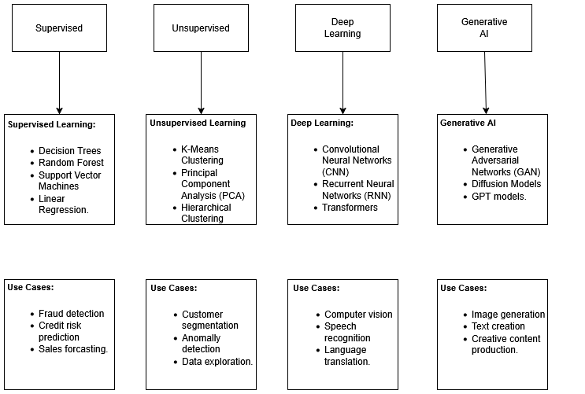

# AI & Machine Learning Algorithm Landscape

## Overview

This project presents a visual framework of major machine learning algorithm categories and their primary application domains. The goal is to demonstrate how different machine learning models align with specific types of data and real-world AI problems.

Understanding the relationship between algorithms and problem domains is essential when designing AI systems.

---

## Algorithm Categories

### Supervised Learning
Supervised learning algorithms learn patterns from labeled data to identify patterns and map inputs to specific desired outputs
Key Functions and Types:
    
- Classification: Categorizes data into distinct groups, such as detecting spam emails, identifying objects in images, or medical diagnosis.
- Regression: Predicts continuous, numerical values, such as forecasting house prices based on features like size and location.
- Pattern Recognition: Identifies underlying relationships between input features and target labels, allowing the model to make, accurate, data-driven decisions

Examples:
- Decision Trees
- Random Forest
- Support Vector Machines
- Linear Regression

Common Use Cases:
- Fraud detection
- Credit risk prediction
- Sales forecasting

---

### Unsupervised Learning

Unsupervised algorithms identify patterns in unlabeled data.

Examples:
- K-Means Clustering
- Principal Component Analysis (PCA)
- Hierarchical Clustering

Use Cases:
- Customer segmentation
- Anomaly detection
- Data exploration

---

### Deep Learning

Deep learning models use neural networks to process complex data such as images, audio, and text.

Examples:
- Convolutional Neural Networks (CNN)
- Recurrent Neural Networks (RNN)
- Transformers

Use Cases:
- Computer vision
- Speech recognition
- Language translation

---

### Generative AI

Generative AI models create new content such as text, images, or audio.

Examples:
- Generative Adversarial Networks (GANs)
- Diffusion Models
- GPT models

Use Cases:
- Image generation
- Text generation
- Creative content production

---

## Visual Framework

---

## Key Insight

Selecting the appropriate algorithm depends heavily on the type of data and the problem being solved. Tree-based models often perform best with structured tabular data, convolutional neural networks dominate computer vision tasks, and transformer architectures have become foundational in modern natural language processing and generative AI systems.
